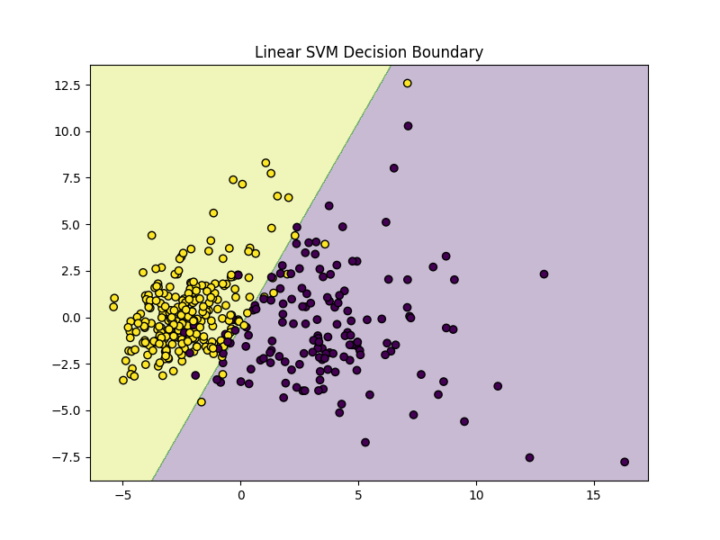
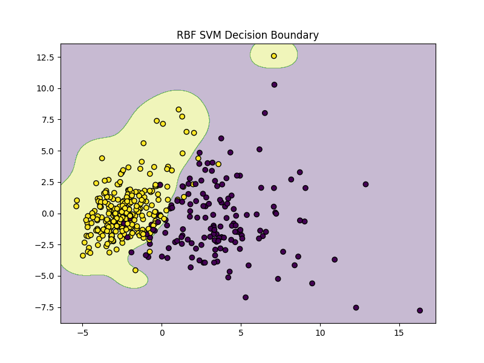

# Breast Cancer Classification using Support Vector Machines

## 🧾 Project Description
This project applies **Support Vector Machine (SVM)** algorithms to classify breast cancer cases into **benign** or **malignant** categories.  
Two types of kernels are explored — **Linear** and **RBF** — to compare performance and visualize decision boundaries.  
The dataset used is the **Breast Cancer Wisconsin Dataset** available in Scikit-learn.

---

## 🔗 Repository Link
[GitHub Repository](https://github.com/Harisivanarayana/svm-breast-cancer-detector/tree/main)

---

## 📚 Tools & Libraries
- Python 3.x
- NumPy – for numerical data handling
- Matplotlib – for plotting decision boundaries
- Scikit-learn – for dataset loading, preprocessing, model training, and evaluation
- PCA – for dimensionality reduction to 2D for visualization

---

## ⚙ Workflow
1. **Load Dataset** – Use the built-in Breast Cancer dataset from `sklearn.datasets`
2. **Preprocess Data** – Standardize features using `StandardScaler`
3. **Dimensionality Reduction** – Apply PCA to reduce features to 2 components
4. **Model Training** – Train Linear SVM and RBF SVM models
5. **Evaluation** – Use 5-fold cross-validation to compare model accuracy
6. **Visualization** – Plot and save decision boundaries for each kernel

---

## 📊 Sample Output
## 📷 Screenshots

